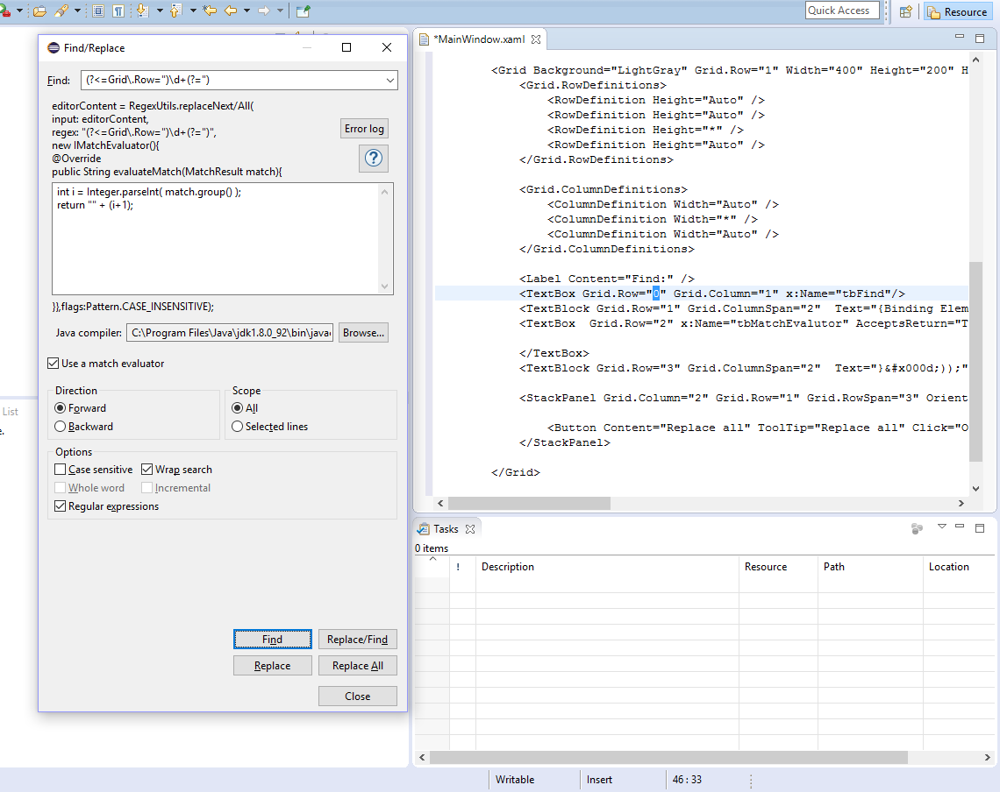
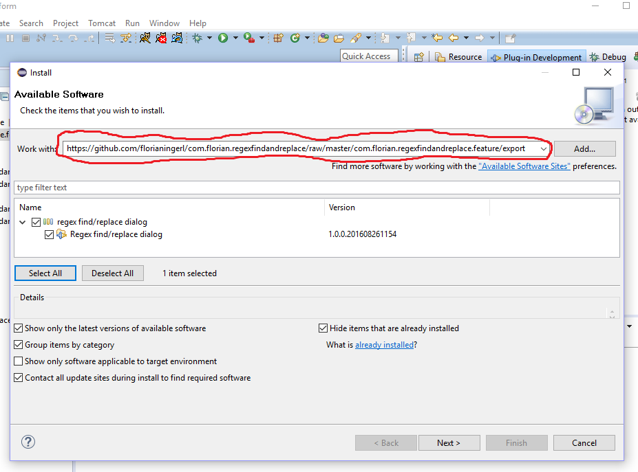

### Introduction
This is an Eclipse plugin that provides the ability to find regular expression matches in an editor and then to replace those matches by writing Java code for a so-called match evaluator. Just hit Ctrl + F5 while a text editor is active and a find/replace dialog will appear.

### What's new :star:

### Version 1.0.1

- Some performence improvements

### Version 1.0.0

Initial version.

### Use cases

If you just work with the replacement string using dollar signs in a replacement operation with regular expressions, you can only reference captured groups, but you can't modify them. With the functionality provided by this plugin, you can modify captured groups! See the following screenshot.

### Installation

In Eclipse, select the menu Help -> Install New Software. Then enter the url https://github.com/florianingerl/com.florianingerl.regexfindandreplace/raw/master/releng/com.florianingerl.regexfindandreplace.updatesite/releases/latest and hit next, accept and finish until the plugin is installed. See the following screenhot

